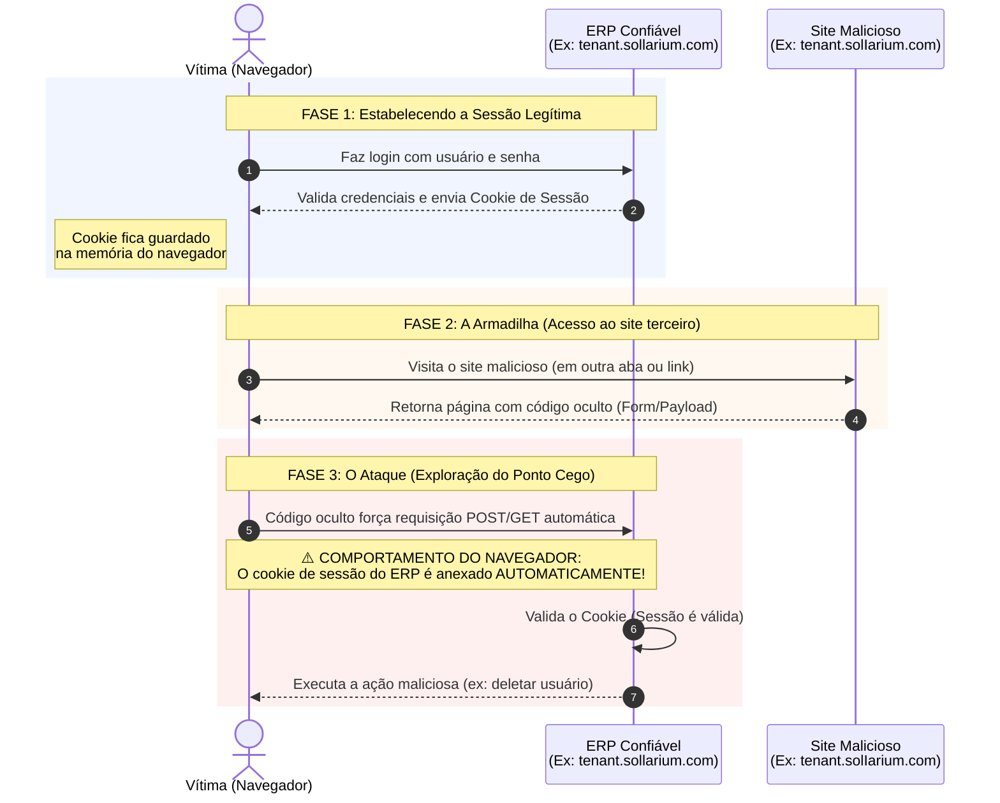
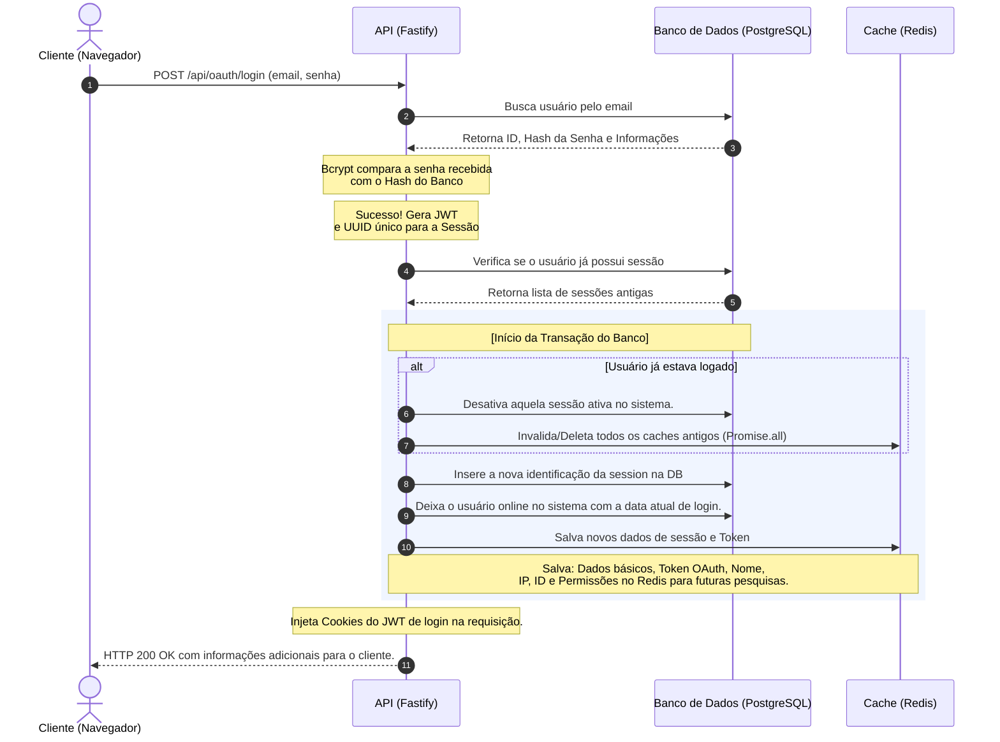
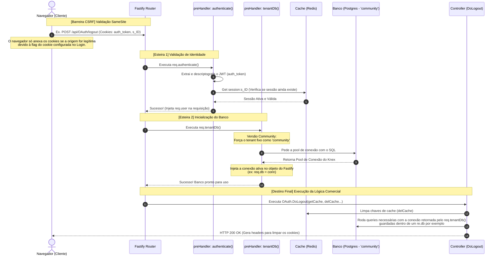

  

<h1 align="center">
Sollarium ERP - Community Edition
</h1>

<h3 align="center">
Seu sistema ERP, open-core, para crescimento empresarial.
</h3>

 

## Sollarium ERP
A versão community do sistema de ERP Sollarium é 100% gratuita e idicada para pequenas empresas focadas em um controle empresarial intuitivo, adaptado para os padrões e tecnologias atualmente presentes no mercado e com sua propria infraestrutura montada, fazendo com que acompanhem a sua tão desejada evolução empresarial.

## Motivação e descrição do sistema
Um sistema de ERP é uma ferramenta que pode escalar o controle empresarial, o que acaba sendo essencial para o bom ecosistema de uma emrpesade qualquer porte. 
Pensando nisso, cheguei a conclusão de que a construção de um sistema ERP acessivel apra pequenas empresas poderia ajudar até mesmo empreendedores a começar seu próprio negócio, sem a necessidade de uma contratação de um sistema ERP, o que incialmente, é um investimento relativamente pesado, deixando toda a carga das decisões financeiras para a carreira empresarial e é ai que nossa versão community do Sollarium entra em ação. 
Para a versão community do sistema, disponibilizamos uma forma para que desenvolvedores internos da sua empresa possam desenvolver modulos compativeis com o sistema, trazendo um dinamismo melhor e mais adequado para a sua empresa, necessitando apenas que os colaboradores envolvidos tenham noções de programação e setup de servidores pois é altamente indicado um load balancer para o uso deste sistema.

## Módulos
O sistema é baseado em modularização de funções e departamentos para sua emrpesa, contemplando alguns modulos necessários para o inicio de um sistema ERP, como os listados abaixo. 
Vale notar que, muitos destes módulos ainda estão em desenvolvimento, marcados com a tag [WIP] para os módulos em desenvolvimento e [New] para os módulos recém desenvolvidos e liberados para o uso.  
<ul>
  <li><b>[WIP] Compras:</b> Um módulo desenhado para realização de compras destinadas a empresa, com geração de documentação completa desde o pedido até o processamento da NF enviada pelo fornecedor.</li>
  <li><b>[WIP] Financeiro:</b> Um módulo desenhado para o controle financeiro completo da sua empresa, contemplando o contas a pagar, contas a receber, um módulo d efaturamento imbutido em todos os módulos com calculos de impostos emissão de documentos e geração de guias, um crm para demonstrativos financeiros e análises, fluxo de caixa e conciliação bancária para integração com bancos da sua empresa.</li>
  <li><b>[WIP] Inventário:</b> Um módulo desenhado para o controle completo de estoque com criação de armazéns com diferentes localizações e configurações para cada um deles, com um controle de estoque detalhando por onde, quando e da onde as mercadorias estão vindo, como foram transitadas, uma auditoria de mudanças e muitas outras informações de controle de ativos.</li>
  <li><b>[WIP] CRM:</b> Um módulo desenhado para o acompanhamento detalhado do ERP, com funil de vendas para controle e anaçise de vendas em andamento, reuniões comerciais a serem feitas seus calendários, conversas com clientes e históricos de informações, automações e visualização de tarefas, sistema de pós venda e sistema de suporte para os clientes estabelecidos.</li>
  <li><b>[WIP] Recursos Humanos:</b> Um módulo focado em todo o ciclo de vida do colaborador, como cadastros de colaboradores, departamentos, funções, controle de folhas de pagamento e gestão de talentos.</li>
</ul>

 

  Tecnologías

<ul>
  <li><b>React:</b> A famosa biblioteca da META esta sendo utilizada para realização deste projeto, trazendo uma facilidade de desenvolvimento para a versão community do Sollarium, e uma compatibilidade enorme com outros navegadores e dispositivos.</li>
  <li><b>Node.js:</b> Para uma melhor facilidade de desenvolvimento para a versão community, estamos usando a versao 24 do node para o desenvolvimento do sistema de API privada do sistema.</li>
  <li><b>Fastify:</b> Uma das melhores frameworks para a criação de APIs restful indicadas para servidores de API utilizando node.js, trazendo agilidade nas requisições e um body-parser robusto imbutido.</li>
  <li><b>Knex / PostgreSQL:</b> Utilizamos o knex, um query builder em conjuunto com o PostgreSQL, que é um dos mais utilizados dentre os bancos de dados destinados a sistemas empresariais.</li>
  <li><b>Redis:</b> Utilizamos o redis para mantermos a agilidade do sistema e um sistema de cache robusto, deixando as respostas da API mais rapida e consumindo menos recursos de hardware em consultas SQL.</li>
  <li><b>Docker:</b> É necessario a utilização do Docker para realização de atualizações automáticas com CI/CD, mantendo também as boas praticas de utilização de containers, preparadas para utilização em produção.</li>
</ul>

 

## Diagramas de comunicações e segurança

<b>Token CSRF</b>

Este token é utilizado para validação do cliente e enviado a cada requisição para o backend em chamadas mutáveis como protocolos POST. É gerado um cookie, não httpOnly, para ser gravado em um header custom chamado X-CSRF-Token evitando ataques de Double Submit Cookie.

<b>OAuth 2.1</b>

O sistema de login se benficia das requisições com o header CSRF para realização de qualquer coisa no sistema, incluindo o login do usuário com a geração de token para utilização da API interna do sistema. 
Abaixo temos um exemplo de como o sistema de login se comporta no sistema, após o processamento do CSRF.

<b>Utilização das endpoints internas</b>

O sistema de login se benficia das requisições com o header CSRF para realização de qualquer coisa no sistema, incluindo o login do usuário com a geração de token para utilização da API interna do sistema. 
Abaixo temos um exemplo de como o sistema de login se comporta no sistema, após o processamento do CSRF.

 

## Copyright e PRs
O codigo é aberto para que os usuários possam realizar a hospédagem, desde que respeitem as diretrizes da licença AGPL3.0, presente neste projeto. 
Pull requests são muito bem vindos para o projeto e em caso de bugs ou problemas de segurança, sinta-se a vontade para abrir uma issue e retornarei para concertar-la o mais rápido possível. 

